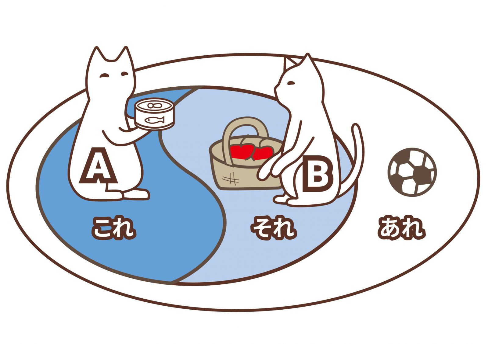


- **「こ」指代下文**  
- **「そ」指代上文**


## 「こ・そ・あ」系列指示词指代方位
- 「こ」表示离说话人近的  
- 「そ」表示离听话人近的  
- 「あ」表示离两者都远的  

---
## 「こ・そ・あ」系列指示词的用法
|  | 「こ」系列 | 「そ」系列 | 「あ」系列 |
| --- | --- | --- | --- |
|  | 指代对象心理上与自己比较亲近时 | 文章中指代前句的内容时 | 讲述个人经历时，描述记忆中的事物或事项 |
| **例句** | 新しい市長が決まった。**この**人は私の高校時代の同級生である | - 書類をどこかに置き忘れた。**それ**には大切な情報が書いてあったのだが...... | 子どものころ、近くの公園でよく遊んだ。**あの**公園はまだ残っているだろうか。 |

---
## 「こ・そ・あ」系列指示词

| 语法 | 使用方法 |
| --- | --- |
| それ・これ | 指代**事物**或**内容**（本身是一个**名词**） |
| そこ・ここ | 指代**场所**或**整体中的某个部分** |
| その・この | 表示**限定**（要**加名词**） |
| そんな・こんな・そういう・こういう | 指代某种情况（要**加名词**） |
| こう・[そう](/n3/i/#そう) | 指代上句，功能和副词类似（要**加动词**） |

- 例句：
    > 妹は一日12時間も寝る。**こんな**人は珍しいのではないか。  
    我妹妹每天要睡12个小时，这样的人是不是很少见呢？

    > この川では最近全く魚が釣れない。**そういう**ことは今までなかった。  
    最近，在这条河里钓不到鱼了。这种情况可从来没有发生过。

    > 困ったとき助けてくれる友達がいる。**そう**思う安心する。  
    困难的时候有朋友会帮你，这样想想就觉得很安心。

    > 忙しい、時間がない。**こう**言い訳するのがわたしのくせだ。  
    “很忙，没时间。”我习惯于找这样牵强的借口。
    
「そ」指代上文，在这里「こう」也能指代上文，是例外吗？」
    

---
## 关联阅读
- [最簡單的東西，總是最難學，來談談「こ、そ、あ」的用法吧！](https://colanekojp.com.tw/blog_detail/58)