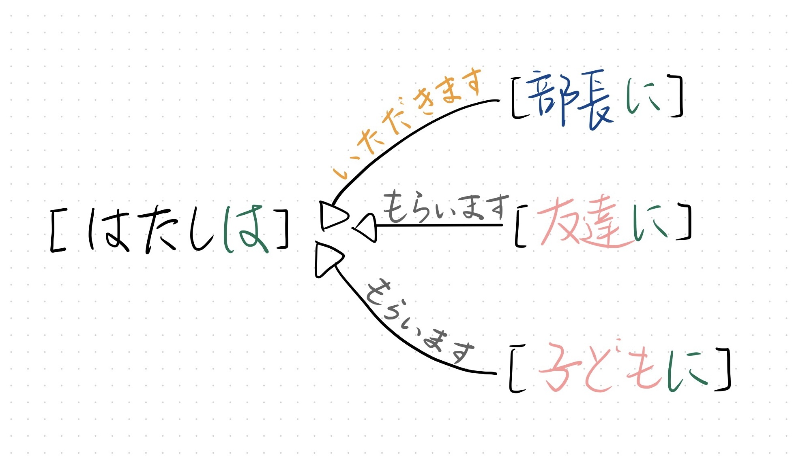
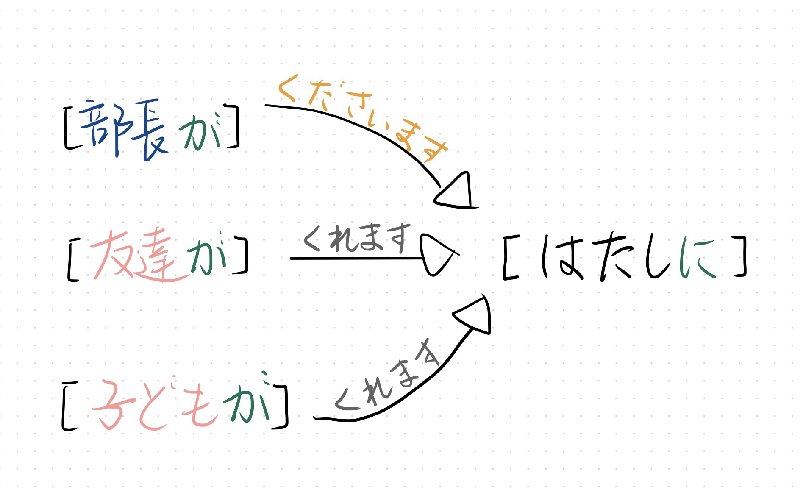
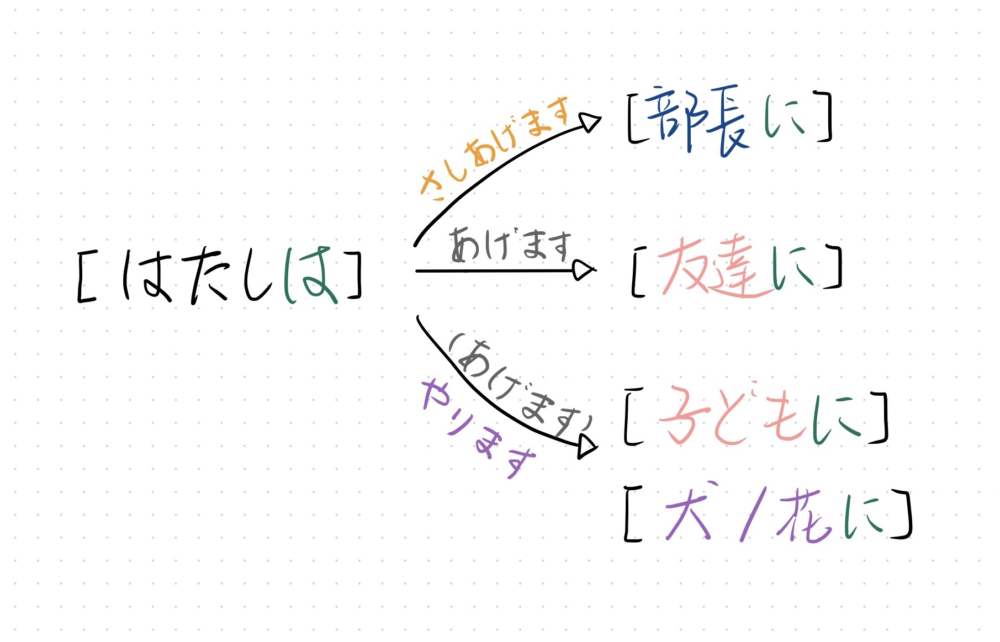

## 授受动词

| 授受动词 | 敬语 | 意味 |
| --- | --- | --- |
| あげます | さしあげます（自谦） | 我给别人・别人给别人 |
| やります || 我给动物或植物 |
| もらいます | いただきます（自谦） | 我接受别人 |
| くれま | くださいます（尊敬） | 别人给我 |

1. 例句：
    > 私は木村さんに花を**あげました**。   
    我给木村花。

    > 私は木村さんに花を**もらいました**。  
    我从木村那收到了花。

    > 木村さんは私に花を**くれました**。  
    木村给我花。

    > 太郎ちゃんはテレザちゃんに花を**あげました**。  
    太郎给テレザ花。

---
## 授受动词的敬语
### 从别人那里接受物品 - いただきます
- **[上司或长辈]に　名词を　いただきます** 
    - 表达：**[我或我方的人]从[上司或长辈]那里接受物品**
    - 例句：
        > 私は**社長に**お土産を**いただきました**。  
         （我得到了总经理赠送的礼品。）

        > 娘は**部長に**お土産を**いただきました**。  
         （（我）女儿得到了部长赠送的礼物。）

### 别人给予物品 - くださいます
- **[わたしに]　名词を　くださいます**
    - 表达：**[上司或长辈]给予[我或我方的人]物品**
    - 例句：
        > 社長が**わたしに**お土産を**くださいました**。  
         （总经理送了礼物给我。）
        
        > 部長が**娘に**お土産を**くださいました**。  
         （部长送了礼物给（我）女儿。）

### 给予别人物品 - さしあげます
- **[晚辈或动植物]に　名词を　やります**
    - **表达：说话人给[部下、晚辈、动物、植物][物品]**
    - 注意：
        - 给「人」一般不用「やります」，用「あげます」更礼貌
        - 给「动物」、「植物」更多用「やります」
    - 例句：
        > わたしは**息子に**お菓子を**やりました（あげました）**。  
         （我给了儿子点心。）

        > わたしは**犬に**えさを**やりました**。  
         （我给狗喂食了。）

---
## 〜てあげます／もらいます／くれます
| 文法 |意味 | 助词 | 备注 |
| --- | --- | --- | --- |
| 〜てあげます | **我为别人做某事** | 宾语的助词不一定是に | 只能用于平辈之间，为长辈或上级做某事用「～ましょうか」 |
| 〜てもらいます | **我请别人为我做某事** | | 主语[私は]可以被省略 |
| 〜てくれます | **别人为我做某事** | 宾语的助词不一定是に | 宾语[私に]可以被省略 |

1. 助词：
    - あげます和くれます的宾语都是行为的接受者，也就是受益人。受益人的助词和用不用あげます、くれます无关，**在句子中原本的含义是什么就用什么助词**。
    - 最常用的「に」只是表示对象的意思。其他可能用到的助词还有「を」、「の」

---
## 〜ていただきます / やります / くださいます

| 语法 | 意味 |
| --- | --- |
| 动词て形 あげます | **我为别人做某事** |
| 〜ていただきま | **我请/麻烦[上级/长辈]为我做某事** |
| 〜てやります | **我为[下级、晚辈、动物、植物]做某事** |
| 〜てくださいます | **[上级/长辈]为我做某事** |

2. 例句：
    > わたしは**課長に**手紙のまちがいを**直していただきました**。  
     （我请科长给我改了信上的错误。）
    
    > 課長の奥さんが[わたしに]お茶を教えてくださいました。  
     （部长的夫人教我茶道了。）

    > 部長が[わたしを]駅まで送ってくださいました。  
     （部长把我送到了车站。）

    > 部長が[わたしの]レポートを直してくださいました。  
     （部长给我改了报告。）

    > わたしは**息子に**紙飛行機を**作ってやりました（あげました）**。  
     （我给孩子做了架纸飞机。）

    > わたしは**犬を散歩に連れて行ってやりました**。  
     （我带狗去散步了。）

    > わたしは娘の宿題を**見てやりました（あげました）**。  
     （我给女儿改了作业。）